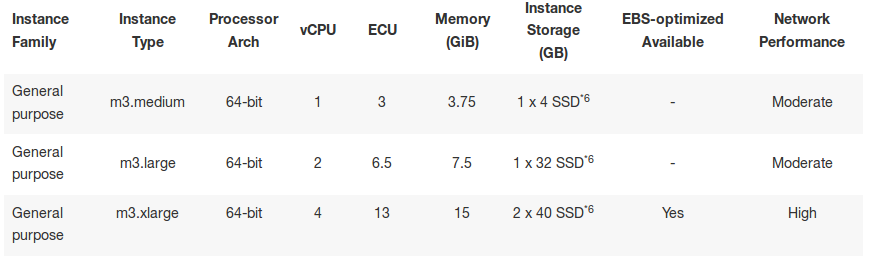

# Configurando el servidor AWS

Asumo ya se tiene la llave en un archivo del tipo `<llave>.pem`.
*Disclaimer*: Esto me funcionó a mi y detallo TODOS los pasos, al ser una mezcla de búsquedas en foros y consultas a *gurus*, no garantizo que esté completo ni mucho menos que sea la mejor manera de hacerlo. Cualquier corrección o comentario es más que bienvenida.

## Características del servidor

El servidor que se eligió es del tipo

General purpose EC2. m3.xlarge

con Ubuntu 13.10 Saucy Salammander instalado. Todas las configuraciones se realizaron para esta versión.

## Primer acceso
Elegido y configurado el servidor, se accede por primera vez a él mediante
~~~{bash}
ssh -i <llave>.pem ubuntu@<ip>
~~~

## Primeras configuraciones
### Lenguaje
Para añadir el lenguaje español de México se ejecuta (aunque creo son redundantes las dos primeras líneas, con la última...)

~~~{bash}
cd /usr/share/locales
./install-language-pack es_MX
sudo locale-gen es_MX
~~~

Para corregir error de comas en lugar de puntos en los decimales se tiene que modificar el archivo
~~~{bash}
sudo nano /usr/share/i18n/locales/es_MX
~~~
buscando la sección `LC_NUMERIC` y reemplazándola por lo siguiente
~~~{bash}
LC_NUMERIC 
decimal_point "<U002E>" 
thousands_sep "<U002C>" 
grouping 3;3 
END LC_NUMERIC
~~~

Para que tome los cambios (no estoy muy seguro de esto)
~~~{bash}
sudo dpkg-reconfigure locales
~~~

### Usuarios

Para crear un usuario sin añadirlo a algún grupo se ejecuta
~~~{bash}
sudo adduser <usuario>
~~~

Para modificar los permisos del usuario recién creado, se utiliza
~~~{bash}
sudo visudo
~~~
Si se quiere que el usuario recién creado tenga derechos de administrador, copiar los derechos del usuario `root` y ponérselos. Poco seguro, pero para nuestros fines, basta.

### Acceso ssh sin contraseña (para parallel)

El comando parallel requiere que se pueda acceder al servidor sin contraseña ni mandando el nombre del archivo `<llave>.pem`. Para esto se hace lo siguiente.

Primero se permite el acceso con contraseña en lugar de llave (`.perm`)
Para esto, se modifica  en el archivo
~~~{bash}
sudo nano /etc/ssh/sshd_config
~~~
la línea que diga
~~~{bash}
PasswordAuthentication yes
~~~
Luego, hace falta reiniciar el servicio `ssh`. Mediante
~~~{bash}
sudo service ssh restart
~~~

Los siguientes pasos son en el cliente local desde el cual se va a conectar uno.

Se sube la llave local al servidor para que sepa que de este cliente vamos a estarnos conectando
~~~{bash}
ssh-copy-id <usuario>@ip
~~~
Si no se ha hecho aún, copiar el archivo `<llave>.pem` a la carpeta `~/.ssh`
~~~{bash}
mv ubicacion/anterior/<llave>.pem ~/.ssh/
~~~
Para añadir los datos del servidor, abrir (o crear, según sea el caso) el archivo
~~~{bash}
nano ~/.ssh/config
~~~
Y añadir el servidor con la siguiente estructura
~~~{bash}
Host <alias servidor>
  IdentityFile <archivo>.pem
  User <usuario>
  HostName <ip>
~~~
Probar que todo haya salido bien con algo del estilo
~~~{bash}
ssh <alias servidor>
~~~
y deberían ingresar automáticamente al servidor aws, así como poder usarlo para procesar cosas en paralelo de manera local con ayuda del servidor.

## Configuración en el servidor

### Algunas instalaciones necesarias
~~~{bash}
sudo apt-get install htop
sudo apt-get install parallel
~~~

Para tener varias sesiones se tienen que renombrar, esto se hace con `ctrl+b` seguido de `$`. Para ver las sesiones disponibles, usar `tmux list-sessions`.

### Compilando R

Lo que me funcionó para cumplir todas las dependencias de `R`, fue descargar las dependencias de `GNU/Octave`. Poco elegante, pero funciona. Las instrucciones para compilar e instalar `GNU/Octave` fueron obtenidas de [aquí](http://blogs.bu.edu/mhirsch/2013/12/compiling-octave-3-8/).

Instalando dependencias
~~~{bash}
sudo apt-get install gfortran debhelper automake dh-autoreconf texinfo texlive-latex-base texlive-generic-recommended epstool transfig pstoedit libreadline-dev libncurses5-dev gperf libhdf5-serial-dev libblas-dev liblapack-dev libfftw3-dev texi2html less libpcre3-dev flex libglpk-dev libsuitesparse-dev gawk ghostscript libcurl4-gnutls-dev libqhull-dev desktop-file-utils libfltk1.3-dev libgl2ps-dev libgraphicsmagick++1-dev libftgl-dev libfontconfig1-dev libqrupdate-dev libarpack2-dev dh-exec libqt4-dev libqscintilla2-dev default-jdk dpkg-dev gnuplot-x11 libbison-dev libxft-dev llvm-dev
sudo apt-get install build-essential libpq-dev liblapack3 libblas3 libmysql++-
~~~

Descargando R
~~~{bash}
mkdir downloads
cd downloads/
wget -c http://cran.r-project.org/src/base/R-3/R-3.0.3.tar.gz
tar zxvf R-3.0.3.tar.gz
cd R-3.0.3/
 ./configure --enable-memory-profiling --enable-R-shlib --with-blas --with-lapack --with-system-zlib --with-system-bzlib --with-system-xz --with-tcltk  --with-cairo --with-libpng --with-jpeglib --with-libtiff
~~~
El proceso terminó con un aviso
~~~
configure: WARNING: neither inconsolata.sty nor zi4.sty found: PDF vignettes and package manuals will not be rendered optimally
~~~
que parece no ser muy grave, así que continuamos.

Preguntando al sr. Google, parece ser que hay problemas con las actualizaciones de `tex`. [Más aquí](http://r.789695.n4.nabble.com/inconsolata-sty-is-liable-to-disappear-texinfo-5-1-td4669976.html).

Poniéndo changuitos de que eso no sea nada grave y siguiendo con la instalación...
~~~{bash}
make
sudo make install
~~~
Y todo salió a pedir de boca.

### Levantando PostgreSQL

Para instalar `PostgreSQL`, se ejecutó
~~~{bash}
sudo apt-get update
sudo apt-get -y install python-software-properties
wget --quiet -O - https://www.postgresql.org/media/keys/ACCC4CF8.asc | sudo apt-key add -
sudo sh -c 'echo "deb http://apt.postgresql.org/pub/repos/apt/ saucy-pgdg main" >> /etc/apt/sources.list.d/postgresql.list'
sudo apt-get update
sudo apt-get install postgresql-9.3 libpq5 postgresql-contrib
~~~
Y todo salió a la perfección. Para probar
~~~{bash}
sudo su postgres
psql
~~~

Regresando al usuario normal, detenemos `PostgreSQL` para crear la carpeta de datos.
~~~{bash}
sudo pg_dropcluster --stop 9.3 main
sudo mkdir /data/
sudo chown postgres /data
sudo pg_createcluster -d /data 9.3 main
sudo service postgresql restart
~~~
Y el penúltimo comando devolvió
~~~{bash}
Creating new cluster 9.3/main ...
  config /etc/postgresql/9.3/main
  data   /data
  locale en_US.UTF-8
  port   5432
~~~
¿Qué no el *locale* ya era `es_MX`?

Para usar librerías compartidas (creo que realmente ni lo necesitaba)
~~~{bash}
LD_LIBRARY_PATH=/usr/local/pgsql/lib
export LD_LIBRARY_PATH
~~~

Para ingresar con mi usuario y sin contraseña a la base de datos se neccesita crear el usuario en la base de datos, con el mismo nombre que el del sistema (se pueden *mapear*, pero podemos ahorrarnos esto).
~~~{bash}
sudo su postgres
psql -c 'create role <usuario> login password '<contraseña>' superuser valid until 'infinity';'
psql -c 'create database rita'
~~~
y empezar a jugar...

### Descargando Rita

~~~{bash}

~~~

## Varios

### Sesión ininterrumpida
Para poder ejecutar cosas en el servidor y poder apagar el cliente sin temor a que se pierda el proceso en curso, se puede usar `screen` o `tmux`. Encontré
información básica entre las diferencias y el uso [aquí](http://askubuntu.com/questions/8653/how-to-keep-processes-running-after-ending-ssh-session). Es una introducción muy básica, la recomiendo para un inexperto como yo.

Para recordar:
Ejecutar *tmux* en la terminal y trabajar ahí. Para salir y dejar las cosas corriendo se hace un *detach* de la sesión con `ctrl+b` y `d`. Para regresar,
`tmux attach`.

### Transferencia de archivos
Aunque creo que este método no es de lo más seguro, funciona.
~~~{bash}
scp /path/to/my.file me@serverB:/path/to/destination/
~~~
Una buena discusión puede verse [aquí](http://www.neowin.net/forum/topic/434399-how-do-i-transfer-files-via-ssh/).

### Espacio disponible en discos
~~~{bash}
df -h
~~~

### Alertas por correo
~~~{bash}
sudo apt-get install mailutils
~~~

## Tiempos de Ejecución

Descarga de Rita en paralelo. `01_descarga.sh`
- 30 segundos

Descompresión de rita, conversión y *split*. `02_crea_csv.sh`
- 25 minutos

## *Tunning* del Servidor

Las modificaciones realizadas fueron:

- shared_buffers = 4GB
- temp_buffers = 16MB
- work_mem = 3GB (para que al correr en paralelo no tire el servidor)
- maintenance_work_mem = 3GB
- wal_buffers = 16MB
- checkpoint_segments = 256
- checkpoint_timeout = 30min
- checkpoint_completion_target = 0.9
- effective_cache_size = 11GB
- default_statistics_target = 10000
- log_destination = 'csvlog'
- logging_collector = on
- log_directory = 'pg_log'
- log_filename = 'postgres-%Y-%m-%d_%H%M%S'
- log_rotation_age = 1d
- log_rotation_size = 1GB
- log_min_duration_statement = 250ms 
- log_checkpoints = on
- log_connections = on
- log_disconnections = on
- log_lock_waits = on
- log_temp_files = 0
- autovacuum = off

[Más información](http://wiki.postgresql.org/wiki/Tuning_Your_PostgreSQL_Server)