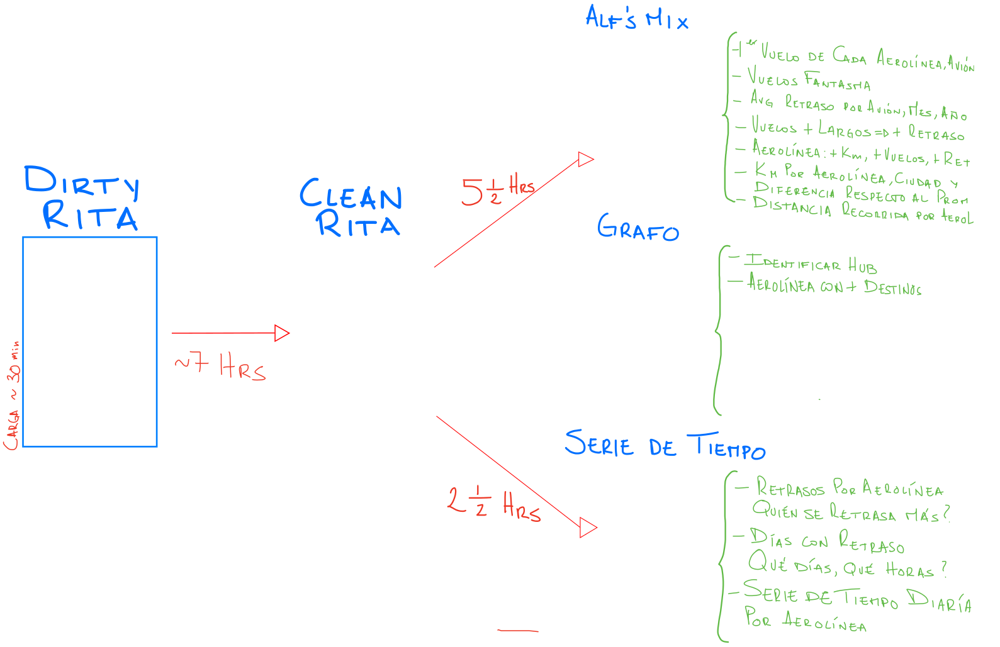

reporte.md
======================================

author: Kael Huerta, Prof. Alfie Garbuno y Pablo Bosch
date: 25 de Marzo de 2014
transition: fade

Tablas
======================================

Se crearon tres tablas auxiliares para responder las preguntas del reporte.

- Alf's Mix 2.1
- Grafo
- Serie de tiempo
- *Tabla de paso*

Plan de ataque
======================================

Preguntas
======================================

  - [Al] ¿Primer vuelo de cada aerolínea? ¿Primer vuelo de cada avión?
  - [Al] ¿Cuál aerolínea tiene más kilómetros, más vuelos, más destinos?
  - [Al] ¿Km por aerolínea, ciudad, y diferencia respecto al promedio de km?
  - [Al] Distancia recorrida por carrier ¿Tiempo de vuelo?
  - [Al] ¿Promedio de retraso por avión, por mes, por año?
  - [Al] ¿Cómo obtener accidentes?
  - [St] Número de retrasos por aerolína, ¿Quién es la que más se retrasa? (`row_num`, `rank`, ...)
  - [St] Días con retraso ¿Qué días? ¿Qué horas?
  - [St] ¿Serie de tiempo (diaria) por aerolínea?
  - [Pa] ¿Vuelos fantasmas? (Por favor pregúnten que es un vuelo fantasma)
  - [Pa] ¿Hay un número de vuelo de mala suerte? ¿De avión?
  - [Pa] ¿Los vuelos mas largos tienen más retrasos?
  - [Gr] ¿Cómo podrían identificar un hub?

Mantra
======================================

**UN CORE UN QUERY**

**UN CORE UN QUERY**

**UN CORE UN QUERY**

**UN CORE UN QUERY**

Demo
======================================

Lecciones Aprendidas
======================================

- No se pueden hacer índices sobre funciones ventana
- No se pueden hacer índices sobre tablas foráneas (fdw)
- Paralelizar siempre es mejor (CPU > RAM y HDD para analíticos)
- **Un core un query**
- Los *workarounds* "de mientras", son permanentes
- Bosqueja lo más rápido posible con pocos datos